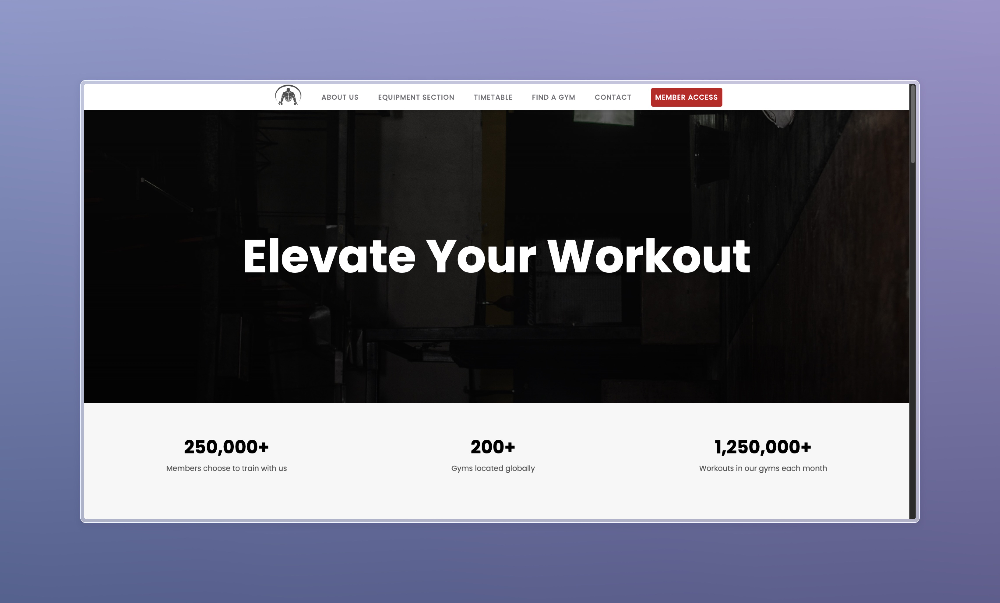
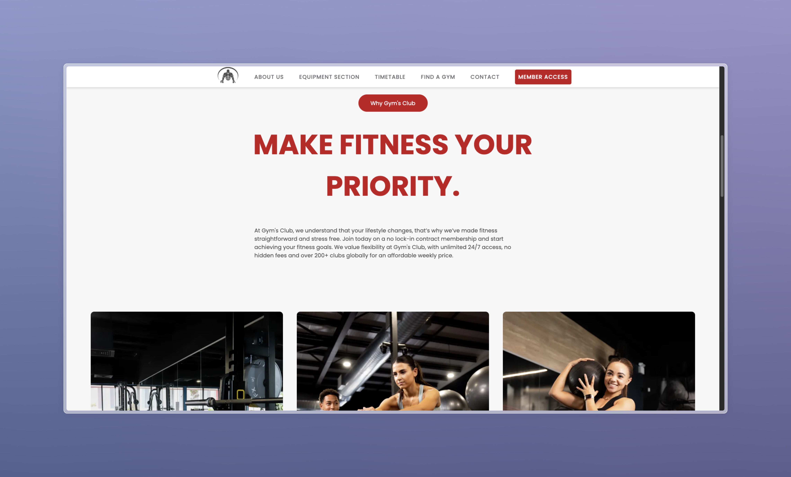
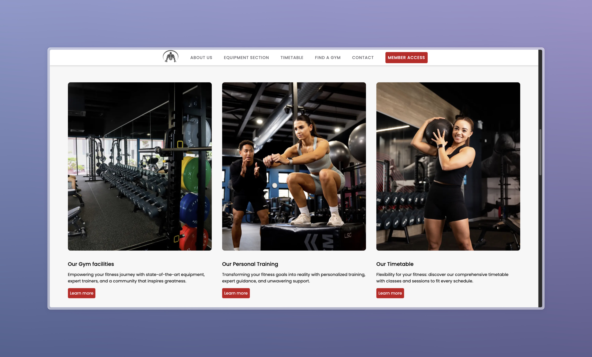
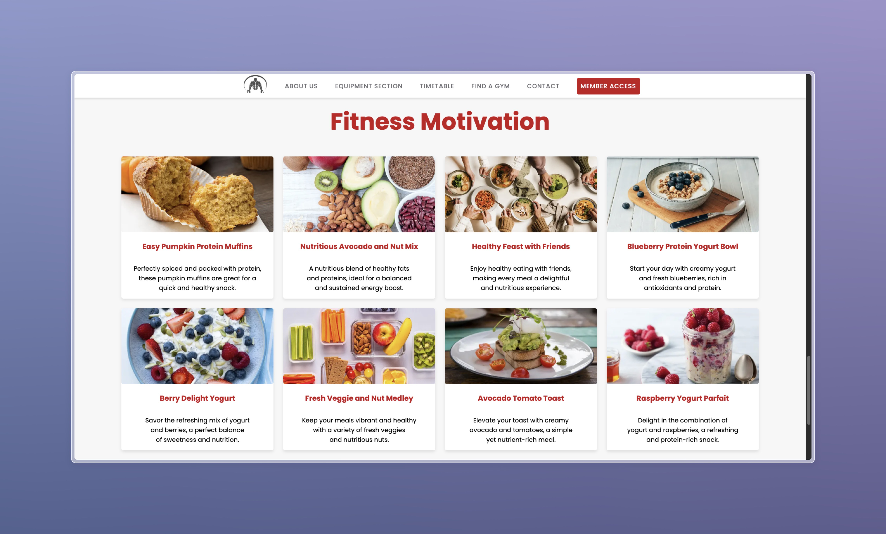
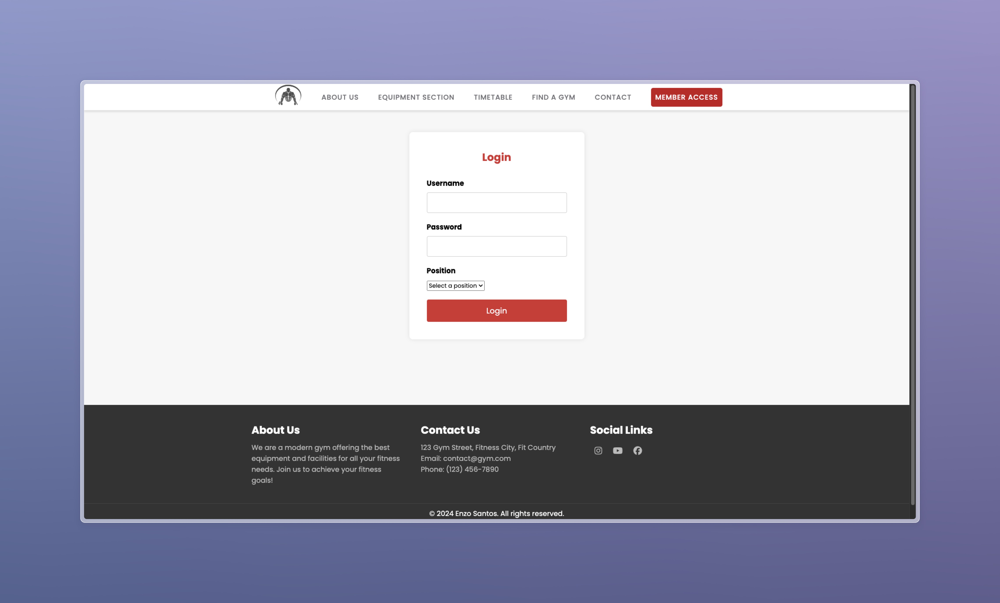
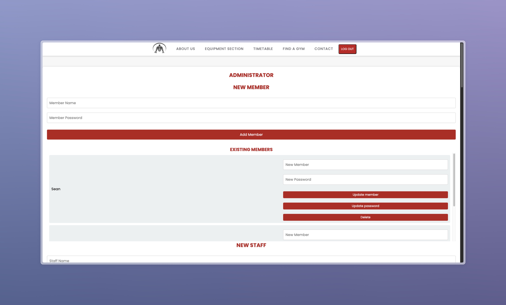
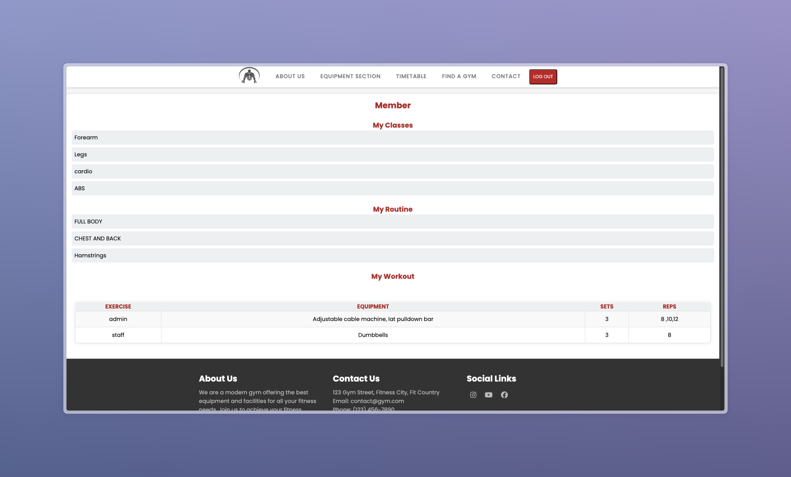

# 🏋️‍♂️💪 Gym's Club

Bem-vindo ao Gym's Club! Este projeto é um site para uma academia que permite o gerenciamento eficiente de membros e classes. Os membros podem visualizar as aulas às quais foram atribuídos. A equipe (staff) pode criar novas aulas, definir repetições, criar rotinas e vincular membros a essas rotinas e exercícios. O administrador tem acesso a todas essas funcionalidades, além da capacidade de adicionar e excluir membros.

## 🚀 Funcionalidades

- Autenticação de Usuário: Sistema de login para membros, staff e administradores.
- CRUD de Membros: Adição, edição e exclusão de membros (apenas para administradores).
- CRUD de Classes: Criação, edição e exclusão de aulas disponíveis na academia.
- CRUD de Exercícios: Criação, edição e exclusão de exercícios, com a possibilidade de definir repetições.
- CRUD de Rotinas: Criação, edição e exclusão de rotinas personalizadas para membros.
- Visualização de Classes e Rotinas: Membros podem visualizar as classes e rotinas às quais estão inscritos.
- Interface de Administração: Funcionalidades para os administradores gerenciarem membros, classes e rotinas, utilizando operações CRUD.

## 🛠️ Tecnologias Utilizadas

- PHP
- MySQL
- HTML
- CSS

## 🗂️ Estrutura do Projeto

```
gym-club/
│
├── functions.php         # Conexão com o banco de dados e funções auxiliares
├── login.php             # Lógica de autenticação
├── dashboard.php         # Painel de controle para usuários autenticados
├── styles.css            # Estilos do site
├── index.php             # Página inicial
└── images/               # Imagens do projeto
```

## Como Executar o Projeto

1. Clone o repositório:
   ```bash
   git clone https://github.com/Enzosantos04/gym-club.git
   ```
2. Navegue até o diretório do projeto:
   ```bash
   cd gym-club
   ```
3. Configure o banco de dados MySQL conforme necessário.
4. Inicie um servidor web (por exemplo, XAMPP) e acesse `http://localhost/gym-club`.

## Imagens do Projeto

# Home Page






# Login page


# Admin dashboard page


# Admin members page

